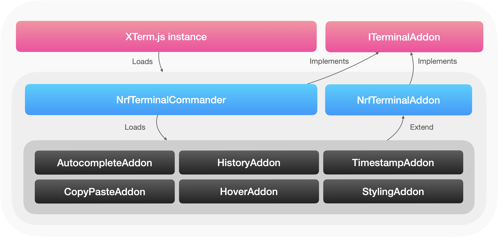

# pc-xterm-lib

This library implements a set of useful features for a rich terminal experience. It is implemented as a modular set of addons for the main [XTerm.js library](https://github.com/xtermjs/xterm.js), so it can be used by any application which uses XTerm.js and would benefit from a terminal with these features.

It should not be considered remotely production ready; there are lots of bugs and missing features, and a lot of polish needed before it can be used in a real application.

## Features

-   [x] Autocompletion
-   [x] Copy and paste support
-   [x] Command history
-   [x] Optional timestamps
-   [ ] Contextual information on hover
-   [ ] Custom styling of defined text / input via regex
-   [ ] Probably lots more

## Usage

Since the library is a normal XTerm addon, usage is as straightforward as initialising it and passing it to your terminal's `loadAddon` method:

```typescript
import { Terminal } from 'xterm';
import { NrfTerminalCommander, NrfTerminalConfig } from 'pc-xterm-lib';

const config: NrfTerminalConfig = {
    completions: [
        {
            name: 'my_custom_command',
            description: 'Does something interesting',
        },
    ],
    commands: {
        my_custom_command: () => {
            console.log('Doing something...');
        },
    },
    prompt: 'AT[:lineCount]>',
    showTimestamps: true,
};

const nrfTerminalCommander = new NrfTerminalCommander(config);

const terminal = new Terminal();
terminal.loadAddon(nrfTerminalCommander);
```

## Architecture

Please see the diagram below and [this presentation](https://nordicsemi.sharepoint.com/:p:/r/sites/Wayland-MAG/Shared%20Documents/General/XTerm_Presentation.pptx?d=wa4a0f7a2b17b4cf5835d328a0908b2cd&csf=1&web=1&e=VyH30T) for information on how the library is structured.



## Feedback

Please report issues to the Wayland team.

## License

See the [LICENSE](LICENSE) file for details.
